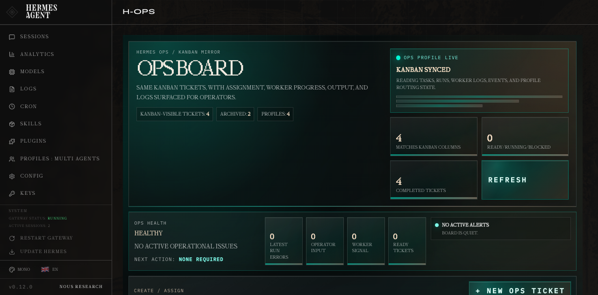
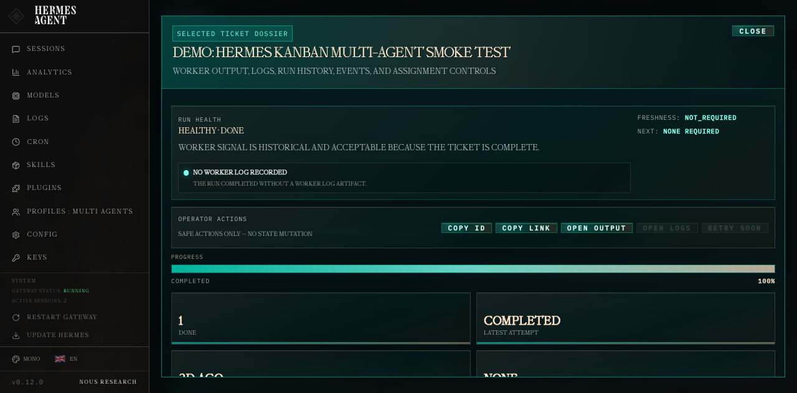

# H-OPS — Hermes Operations Cockpit

> A dark, tactical operations console for Hermes Agent Kanban: health, assignment, progress, logs, output, and run history in one place.



H-OPS is a third-party **Hermes Agent dashboard plugin** that turns the built-in Hermes Kanban queue into an operator-facing cockpit.

Kanban remains the source of truth. H-OPS is the read model you open when you want to know:

- What are my agents working on?
- Which tickets are ready, running, blocked, or done?
- Is anything stale, unassigned, or risky?
- Who owns the work?
- What did the worker output?
- Where are the logs, events, and run history?

It is designed for people running Hermes with multiple profiles/workers and wanting something closer to an **agent operations room** than a generic task board.

---

## Why this exists

Hermes Kanban is powerful because it gives agents durable work items, assignees, dependencies, event history, and run handoffs.

But as an operator, you often do not want to inspect raw task internals. You want a fast answer:

> Is the system healthy, and what needs my attention?

H-OPS gives Kanban an operations cockpit:

- a six-lane board that mirrors Kanban workflow
- progress bars and heartbeat freshness on every card
- board-level health/risk summary
- assignee-aware routing controls
- ticket dossier popup with output, logs, runs, events, and artifacts
- safe operator actions such as copy ID/link and open output/logs

---

## Screenshots and demo

### Mission Control

A high-level board with health, queue counts, profile load, filters, status strips, progress, and muted dark-teal action gradients.


### Ticket Dossier

Click any ticket to open a large dossier focused on run health, worker output, logs, and history.



### Hermes Kanban demo video

A short Hermes Kanban workflow recording is included for context: creating/operating on Kanban-backed agent work, then inspecting that work through H-OPS.

[](assets/hermes-kanban.mp4)

[Watch the Hermes Kanban demo video](assets/hermes-kanban.mp4).

---

## Features

### Ops health at the top

H-OPS computes a board-level operational summary:

- failed latest runs
- blocked tickets
- stale running workers
- ready-but-unassigned tickets
- current running count
- next recommended action

A quiet board says so. A risky board should tell you exactly where to look.

### Ticket-level run health

Completed tickets with old heartbeats are not treated as false alarms.

For example, a completed ticket can show:

```text
Run health: healthy · done
Freshness: not_required
Worker signal is historical and acceptable because the ticket is complete.
Next: none required
```

Running tickets with stale/missing heartbeat are surfaced as critical.

### Kanban-native board

H-OPS mirrors the existing Hermes Kanban statuses:

```text
triage → todo → ready → running → blocked → done
```

It does not create a second task system. It reads and mutates the existing Kanban data where supported.

### Operator-friendly filters

Filter by:

- free-text search
- status
- assignee/profile
- problems only
- unassigned only

### Assignment controls

Create and reassign tickets with a dropdown of known Hermes profiles instead of free-text guessing.

### Output and log tooling

The selected-ticket dossier includes:

- current output/result
- worker log preview
- copy/download/open controls
- detected text/Markdown artifacts
- structured run history
- event timeline

### Tactical dashboard styling

The UI uses a dark operations-console style:

- smoky gradients
- thin technical borders
- teal/amber/red health semantics
- progress strips
- selected-ticket dossier modal
- compact monospaced labels

---

## Installation

> Requires a working Hermes Agent installation with dashboard plugin support.

Use the Hermes plugin installer. It installs the GitHub repository into your Hermes plugin directory and can enable it in the same step:

```bash
hermes plugins install tmdgusya/h-ops --enable
```

If the dashboard is already running, rescan plugins:

```bash
curl http://127.0.0.1:9119/api/dashboard/plugins/rescan
```

If backend API routes do not appear immediately, restart the dashboard because plugin APIs are mounted when the dashboard starts:

```bash
hermes dashboard
```

Then open:

```text
http://127.0.0.1:9119/h-ops
```

For local development, clone the repository yourself and then enable it:

```bash
mkdir -p ~/.hermes/plugins
git clone https://github.com/tmdgusya/h-ops.git ~/.hermes/plugins/h-ops
hermes plugins enable h-ops
```

---

## Verification

From the repository root:

```bash
python3 -m py_compile dashboard/plugin_api.py
node --check dashboard/dist/index.js
python3 -m unittest discover -s tests -v
```

Expected result:

```text
Ran 3 tests
OK
```

You can also check the plugin health endpoint once the dashboard is running:

```bash
curl http://127.0.0.1:9119/api/plugins/h-ops/health
```

---

## API surface

Mounted under:

```text
/api/plugins/h-ops/
```

Current endpoints:

```text
GET   /health
GET   /interfaces
GET   /overview
GET   /ops-board
GET   /tickets/{task_id}
GET   /tickets/{task_id}/log
POST  /tickets
PATCH /tickets/{task_id}/assign
GET   /agents
GET   /events?limit=50&task_id=...
```

---

## Repository layout

```text
h-ops/
├── dashboard/
│   ├── manifest.json
│   ├── plugin_api.py
│   └── dist/
│       ├── index.js
│       └── style.css
├── docs/
│   ├── interfaces.md
│   └── ux-plan.md
├── tests/
│   └── test_ops_health.py
├── assets/
│   ├── h-ops-main-board.png
│   ├── h-ops-ticket-dossier.png
│   └── hermes-kanban.mp4
└── README.md
```

---

## Design principles

### Kanban is the kernel

H-OPS should not invent a parallel task system. It should read from and operate on Hermes Kanban tasks, runs, events, links, comments, and assignees.

### Start safe

The plugin currently prioritizes safe operator actions. Actions such as retry/requeue should only be enabled once there are real backend state transitions and event history.

### Show interpretation, not just state

Raw status is not enough. Operators need interpretation:

```text
Heartbeat 2d ago
```

is ambiguous. H-OPS translates that into:

```text
OK because the run is complete
```

or:

```text
Critical because the task is still running
```

### Make agent work inspectable

Every task should quickly answer:

- who owns it
- what state it is in
- how far along it is
- when the worker last signaled
- what output exists
- what logs/events/runs explain the state

---

## Roadmap

- Retry / requeue / reopen endpoints backed by Kanban events
- Dense table mode for production operators
- Event stream severity mapping
- Dependency graph / critical path view
- Worker tail/follow mode for logs
- Audit trail for operator actions
- Environment badges for local/dev/prod
- Better deep links into original Kanban records

---

## Notes and caveats

- H-OPS is intended for local Hermes dashboard usage.
- It currently reads from the existing Kanban SQLite-backed model.
- The UI is distributed as dashboard `dist/` files for easy plugin installation.
- If you update backend routes while the dashboard is running, restart the dashboard process so FastAPI remounts the plugin API.

---

## License

MIT
